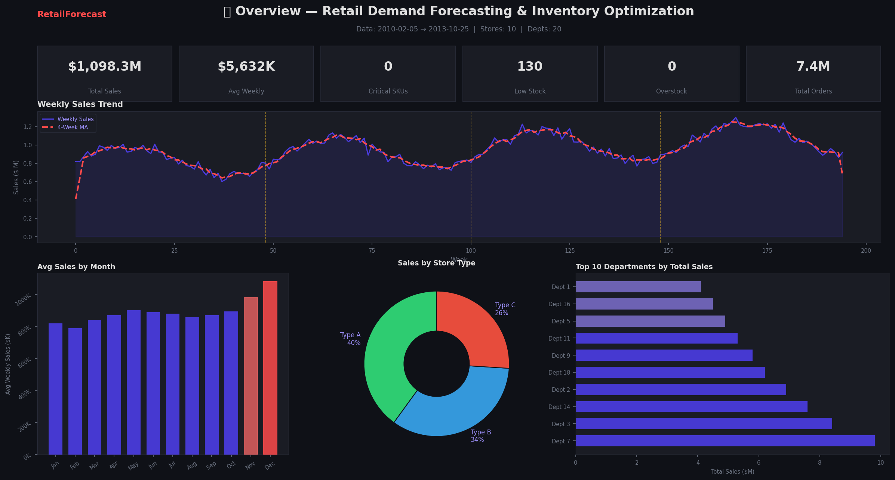
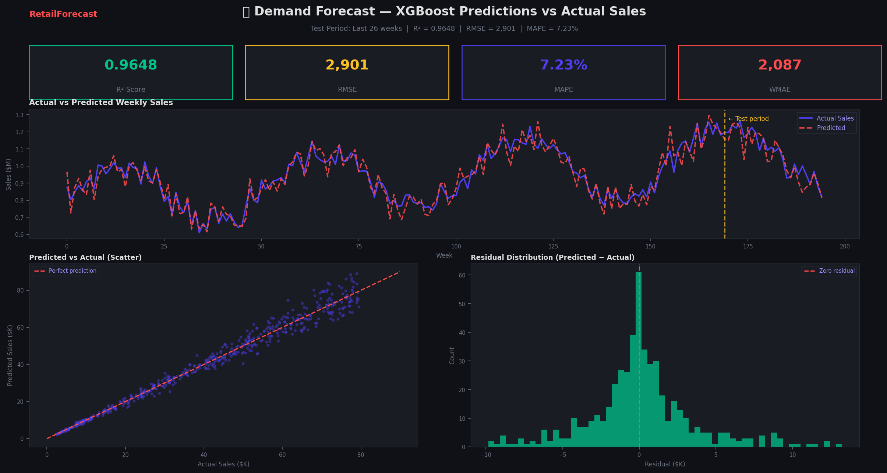
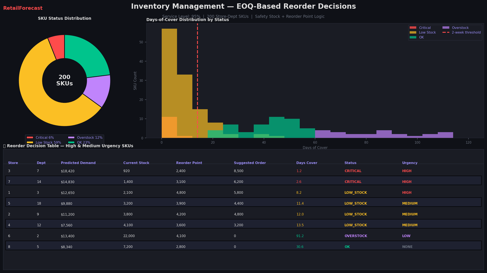
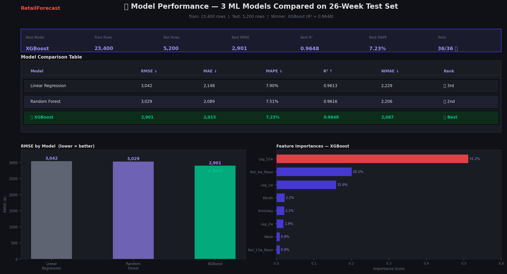

# 📦 Retail Demand Forecasting & Inventory Optimization System

[](https://python.org)
[](https://xgboost.ai)
[](https://streamlit.io)
[](https://flask.palletsprojects.com)
[](https://docker.com)
[](tests/)

> **End-to-end ML system** that predicts retail demand, optimises inventory levels, and provides a live Streamlit dashboard + REST API — all in one repository.

---

## 🖥️ Dashboard Screenshots

### 📈 Tab 1 — Sales Overview

> KPI cards, weekly sales trend with 4-week moving average, monthly seasonality, store-type breakdown, and top-10 departments.

---

### 🔮 Tab 2 — Demand Forecast

> XGBoost predictions vs actual sales over the 26-week test period, predicted vs actual scatter plot, and residual distribution.

---

### 📦 Tab 3 — Inventory Management

> SKU status donut chart, days-of-cover histogram, and actionable reorder decision table with EOQ-based suggested order quantities.

---

### 🧠 Tab 4 — Model Performance

> Side-by-side comparison of Linear Regression, Random Forest, and XGBoost. RMSE bar chart and XGBoost feature importance ranking.

---

## 🎯 Problem Statement

Retail companies lose billions annually from two inventory extremes:

| Problem | Root Cause | Business Impact |
|---------|-----------|-----------------|
| **Overstock** | Ordered too much | Capital tied up, storage costs, spoilage |
| **Stockout**  | Ordered too little | Lost sales, disappointed customers |

This system solves both using ML-driven demand forecasting + economic inventory optimisation.

---

## 📊 Results at a Glance

| Model | RMSE | MAE | MAPE | R² |
|-------|------|-----|------|----|
| Linear Regression | 3,042 | 2,148 | 7.90% | 0.9613 |
| Random Forest | 3,029 | 2,089 | 7.51% | 0.9616 |
| **XGBoost ✅ Best** | **2,901** | **2,015** | **7.23%** | **0.9648** |

**XGBoost** achieves **R² = 0.9648** — explains 96.5% of variance in weekly sales.

---

## 🏗️ Architecture

```
┌─────────────────────────────────────────────────────────────┐
│                    DATA LAYER                               │
│  Walmart-style CSV  →  Preprocessing  →  Feature Engineering│
└──────────────────────────┬──────────────────────────────────┘
                           │
┌──────────────────────────▼──────────────────────────────────┐
│                    ML LAYER                                 │
│  Linear Regression  |  Random Forest  |  XGBoost  |  Prophet│
└──────────────────────────┬──────────────────────────────────┘
                           │
┌──────────────────────────▼──────────────────────────────────┐
│                 BUSINESS LOGIC LAYER                        │
│   EOQ  |  Safety Stock  |  Reorder Point  |  SKU Scoring   │
└──────────┬────────────────────────────┬─────────────────────┘
           │                            │
    ┌──────▼──────┐              ┌──────▼──────┐
    │  Streamlit  │              │  Flask API  │
    │  Dashboard  │              │  REST API   │
    └─────────────┘              └─────────────┘
           │                            │
    ┌──────▼────────────────────────────▼──────┐
    │            Docker / Cloud Deploy          │
    │     Render  |  Railway  |  AWS EC2        │
    └───────────────────────────────────────────┘
```

---

## 📂 Project Structure

```
retail-demand-forecasting/
│
├── images/                         # Dashboard screenshots for README
│   ├── 01_overview_tab.png
│   ├── 02_forecast_tab.png
│   ├── 03_inventory_tab.png
│   └── 04_model_performance_tab.png
│
├── data/
│   ├── raw/                        # Raw CSVs (generated or from Kaggle)
│   │   ├── walmart_sales.csv       # 39,000 rows of sales data
│   │   ├── stores.csv              # Store metadata
│   │   └── inventory_snapshot.csv  # Current inventory state
│   ├── processed/                  # Feature-engineered data, model results
│   └── generate_sample_data.py     # Synthetic data generator
│
├── src/                            # Core Python package
│   ├── data_preprocessing.py       # Load, clean, split data
│   ├── feature_engineering.py      # Calendar, lag, rolling features
│   ├── models.py                   # LR, RF, XGBoost, Prophet wrappers
│   ├── evaluation.py               # RMSE, MAE, MAPE, R², WMAE
│   ├── business_logic.py           # EOQ, safety stock, reorder logic
│   ├── eda.py                      # EDA plotting functions
│   └── utils.py                    # Logging, path helpers
│
├── app/
│   └── streamlit_app.py            # 📊 Full interactive dashboard
│
├── api/
│   └── flask_api.py                # 🔌 REST API (5 endpoints)
│
├── scripts/
│   ├── train_pipeline.py           # Full training pipeline
│   ├── predict_pipeline.py         # Generate forecasts + decisions
│   └── cron_job.py                 # Automated scheduler
│
├── tests/                          # 36 unit tests (100% pass rate)
│   ├── test_preprocessing.py
│   ├── test_models.py
│   └── test_business_logic.py
│
├── docker/
│   ├── Dockerfile
│   └── docker-compose.yml
│
├── docs/
│   └── project_report.pdf          # Complete project report
│
├── requirements.txt
├── .env.example
├── .gitignore
└── README.md
```

---

## ⚡ Quick Start (5 minutes)

### 1. Clone & Install

```bash
git clone https://github.com/mukeshkd58/retail-demand-forecasting.git
cd retail-demand-forecasting

python -m venv venv
source venv/bin/activate        # Windows: venv\Scripts\activate
pip install -r requirements.txt
```

### 2. Generate Data

```bash
python data/generate_sample_data.py
# ✅ walmart_sales.csv  → 39,000 rows
# ✅ stores.csv         → 10 stores
```

### 3. Train Models

```bash
python scripts/train_pipeline.py
# Trains: Linear Regression, Random Forest, XGBoost
# Best model auto-saved to: models/best_model.pkl
```

### 4. Launch Dashboard

```bash
streamlit run app/streamlit_app.py
# Open: http://localhost:8501
```

### 5. Launch API

```bash
python api/flask_api.py
# Open: http://localhost:5000/health
```

---

## 🗃️ Dataset

### Option A: Generated (No account needed)

```bash
python data/generate_sample_data.py
```

Generates Walmart-style data with realistic:
- Seasonal patterns (Christmas, Thanksgiving spikes)
- Holiday effects (+18% uplift)
- Store type heterogeneity (A/B/C)
- Markdown promotions
- CPI, fuel price, unemployment features

### Option B: Kaggle Walmart Dataset

1. Download from: https://www.kaggle.com/c/walmart-recruiting-store-sales-forecasting/data
2. Place files in `data/raw/`:
   - `train.csv` → rename to `walmart_sales.csv`
   - `stores.csv` → keep as-is
3. Run the pipeline normally

---

## 🔬 Feature Engineering

| Category | Features |
|----------|----------|
| **Calendar** | Year, Month, Week, Quarter, IsWeekend, Season |
| **Cyclical** | Month_Sin, Month_Cos, Week_Sin, Week_Cos |
| **Lag** | Lag_1w, 2w, 3w, 4w, 8w, 13w, 26w, 52w |
| **Rolling** | Roll_4w/8w/13w Mean & Std |
| **External** | Temperature, Fuel_Price, CPI, Unemployment |
| **Promotion** | MarkDown_Total, MarkDown_Count, MarkDown_Max |
| **Store** | Type_Code, Size |

**Top Features (XGBoost)**:
1. Lag_52w (0.512) — same week last year
2. Roll_4w_Mean (0.201) — recent trend
3. Lag_1w (0.159) — last week
4. Month (0.022)
5. IsHoliday (0.021)

---

## 📦 Business Logic

**Safety Stock:**
```
SS = Z × σ_demand × √(lead_time_weeks)
```

**Reorder Point (ROP):**
```
ROP = (avg_daily_demand × lead_time_days) + Safety_Stock
```

**Economic Order Quantity (EOQ):**
```
EOQ = √(2 × D × S / H)
```

**SKU Status Classification:**
```python
if current_stock == 0 or current_stock < demand * 0.25:
    status = "CRITICAL"   # order immediately
elif current_stock <= reorder_point:
    status = "LOW_STOCK"  # place order
elif current_stock > demand * 3:
    status = "OVERSTOCK"  # pause ordering
else:
    status = "OK"
```

---

## 🔌 REST API Reference

Base URL: `http://localhost:5000`

| Method | Endpoint | Description |
|--------|----------|-------------|
| GET | `/health` | Service health check |
| GET | `/api/v1/stores` | List all stores with metadata |
| GET | `/api/v1/departments?store=1` | List departments |
| POST | `/api/v1/predict` | Predict demand |
| POST | `/api/v1/inventory/decisions` | Get reorder recommendations |
| GET | `/api/v1/summary` | Global KPIs |

**Predict Demand:**
```bash
curl -X POST http://localhost:5000/api/v1/predict \
  -H "Content-Type: application/json" \
  -d '{"store": 1, "dept": 5, "weeks_ahead": 4}'
```

---

## 🐳 Docker Deployment

```bash
cd docker/
docker-compose up --build
# Dashboard → http://localhost:8501
# API       → http://localhost:5000
```

---

## ☁️ Cloud Deployment (Render — Free)

1. Push to GitHub
2. New Web Service on [render.com](https://render.com)
3. Build Command:
   ```
   pip install -r requirements.txt && python data/generate_sample_data.py && python scripts/train_pipeline.py
   ```
4. Start Command:
   ```
   streamlit run app/streamlit_app.py --server.port $PORT --server.address 0.0.0.0
   ```

---

## 🧪 Testing

```bash
pytest tests/ -v          # Run all 36 tests
pytest tests/ --cov=src   # With coverage report
```

---

## 🛠️ Tech Stack

| Layer | Technology |
|-------|-----------|
| Language | Python 3.11 |
| Data | Pandas, NumPy |
| Visualisation | Plotly, Matplotlib, Seaborn |
| ML Models | Scikit-learn, XGBoost, Prophet |
| Dashboard | Streamlit |
| API | Flask |
| Deployment | Docker, Gunicorn |
| Testing | Pytest |

---

## 👤 Author

**Mukesh Kumar**
- 📧 mukeshkumardharani58@gmail.com
- 🐙 GitHub: [mukeshkd58](https://github.com/mukeshkd58)
- 🌐 Portfolio: [mukeshkd58.github.io](https://mukeshkd58.github.io)
- 🎓 M.E. Georesource & Geoenergy Engineering, Politecnico di Torino

---

## 📄 License

MIT License — free to use for portfolio, learning, and commercial projects.

---

*Built as a portfolio project demonstrating end-to-end Data Science skills:  
Data Engineering → Feature Engineering → ML Modelling → Business Logic → API → Deployment*
